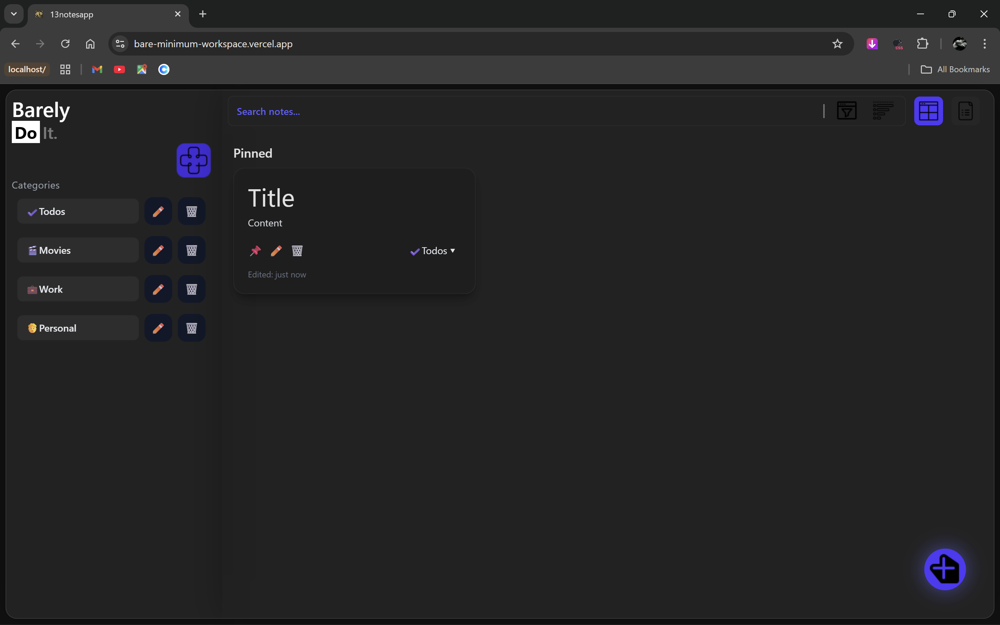

# 🧊 The Bare Minimum Workspace

Bare Minimum Workspace is a minimal, glass-UI notes and categories manager built for speed, clarity, and absolutely no unnecessary drama.  
Despite the name, it performs at **peak efficiency** — fast search, instant filtering, pinned notes, modal editing, and smooth UI transitions.
---
### 🔗 Live Demo <br/>
 👉 https://bare-minimum-workspace.vercel.app/

### 📸 Preview



## 🚀 Features  
- 🔍 Real-time search + category filtering  
- 📌 Pinning system for priority notes  
- 🗂 Organized categories  
- 📝 Clean modal editor with glass aesthetics  
- 🎨 Dark translucent UI with subtle animations  
- 📦 Powered by Redux Toolkit + Vite  
- 🌐 Deploy-ready for Vercel
---

## 🛠 Tech stack
- React (Vite)
- Redux Toolkit
- Tailwind CSS (v4) via `@tailwindcss/vite`
- nanoid for IDs
- JS utilities (no heavy date libs)
---

## 📚 Core Capabilities
- Create / edit / soft-delete / restore notes
- Categories management (create / rename / delete)
- Tags (labels) support (optional)
- Sort by date/title/category / pinned-first behavior
- Full-screen note modal with autosave and keyboard shortcuts
- Theme switching (system / light / dark) with CSS variables
- `formatTimeAgo` utility for human-friendly timestamps


## Dev setup

1. Clone
```bash
git clone <repo-url>
cd notes-app
```
2. Install
```bash
pnpm install
```
3. Run dev server
```bash
pnpm dev
# open http://localhost:5173
```
4. Build
```bash
pnpm build
```
5. Preview build
```bash
pnpm preview
```
# Project structure
```bash
src/
  features/          # redux slices (notes, categories, theme)
  components/
    notes/           # NoteList, NoteCard, NoteModal, AddNote, EditNote
    category/        # CategoryList, CategoryItem, AddCategory
    layout/          # AppLayout, Sidebar, Mainarea
  utils/
    formatTimeAgo.js
  index.css
  main.jsx
```

## Why I Built This

I built this project to improve my understanding of how real note-taking tools work under the hood:

- Structuring React components for scalable UI
- Managing data and UI states cleanly using Redux Toolkit
- Implementing sorting, searching, and filtering logic for large lists
- Understanding performance patterns (memoization, stable handlers)
- Working with timestamps, formatters, and state-driven UI
- Building a theme system using CSS variables (light/dark/system)
- Organizing multi-feature apps for future expansion

This app was intentionally built without heavy libraries — the goal was to learn how to implement the core logic myself instead of relying on prebuilt solutions.
